<h1 style="text-align: center;"> Project 1 Report </h1>

- [source notebook](./project_1.ipynb)
- [toy example animation](./toy_example.mp4)
- [$H_2$-$N_2$ competitive binding animation](./ru_h2_n2_binding.mp4)

[back](../README.md)

---------------------------------

# Example system
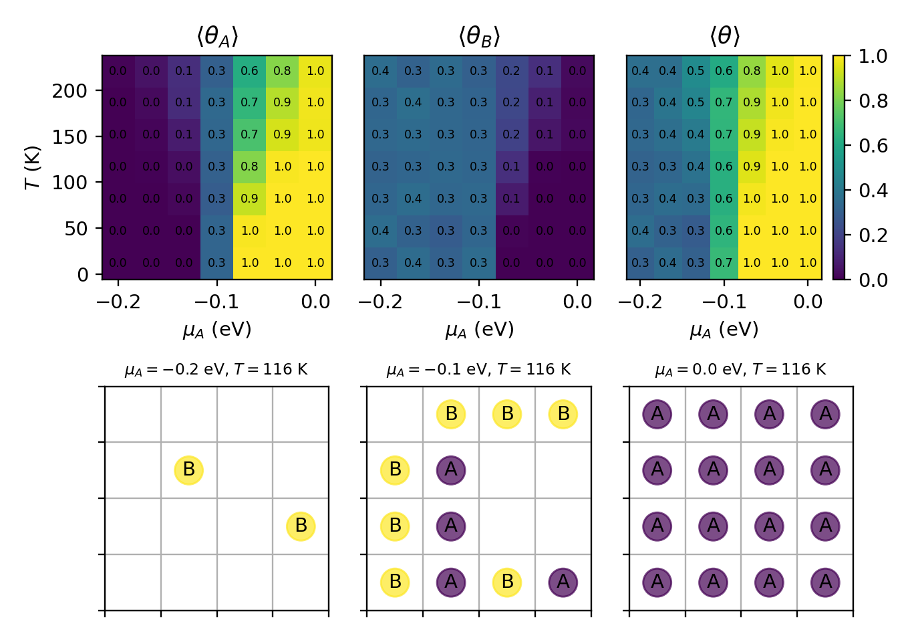

# Exploring adsorption of $N_2$ and $H_2$
- Phase diagrams:
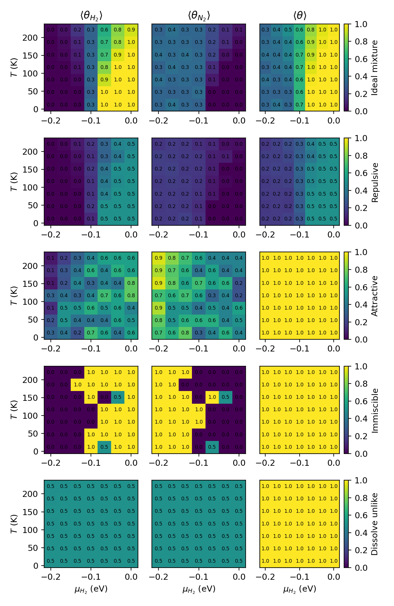
- Example lattice configurations:
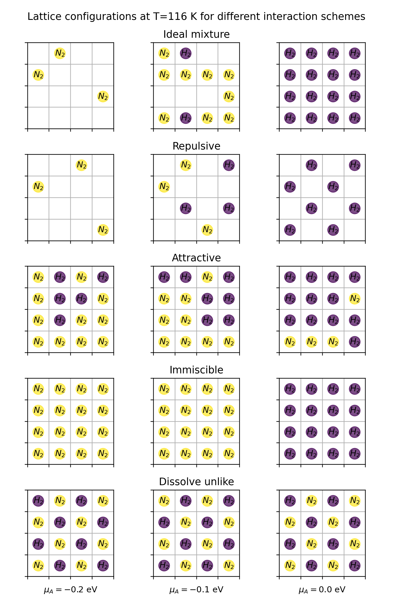

## Discussion of adsorption behaviors

$$N_2 + 3H_2 \rightarrow 2NH_3$$
In all simulations, we set the adsorption energy of $H_2$ and $N_2$ to $-0.1eV/mol$.

- **Ideal Mixture**\
    In this model, the interactions between adsorbed $H_2$ and $N_2$ are ignored.
    - *temperature*: At a given $\mu_{H_2}$, both $\theta_{H_2}$ and $\theta_{N_2}$ decreases, leading to a decrease in $\theta$. This is expected, as the gas phase has greater entropy, and an increase in temperature favors the gain in entropy by the gas phase over the gain in enthalpy by the adsorbed phase.
    - *$\mu_{H_2}$*: At a given temperature, as $\mu_{H_2}$ increases, $\theta_{H_2}$ increases, while $\theta_{N_2}$ decreases. This is expected, as species seek to minimize their chemical potentials, and a higher chemical potential in the gas phase would drive $H_2$ into the adsorbed phase. This higher tendency to bind the surface would exclude $N_2$ from binding, leading to a decrease in $\theta_{N_2}$. Since $\mu = \mu^0 + RTln(P/P^0)$ for an ideal gas, a higher $\mu$ means a higher pressure. It makes sense that under higher $H_2$ pressure, more $H_2$ would bind the surface, which takes the place of $N_2$.
    - *Optimal condition*: The optimal condition for ammonia synthesis should ideally have a ratio of 3:1 for adsorbed $H_2$:$N_2$, and the two species should be near each other to react. The total coverage is maximized at low temperature and high $\mu_{H_2}$, but high $\mu_{H_2}$ also excludes $N_2$ from binding. The optimal condition seems to be $-0.08 eV/mol < \mu_{H_2} < -0.05 eV/mol$ and $125 K < T < 250 K$, where coverage of $H_2$ is around 0.7 and $N_2$ around 0.2. Although the total coverage is less than 1, this optimizes the ratio of $H_2$:$N_2$.

- **Repulsive**\
    In this model, the interaction energies between adsorbed $H_2$ and $N_2$ are all positive, indicating pairwise repulsion.
    - *temperature*: With increasing temperature, both $\theta_{H_2}$ and $\theta_{N_2}$ and the total coverage still decreases, but the effect is smaller or unobservable compared with the ideal mixture.
    - *$\mu_{H_2}$*: With increasing $\mu_{H_2}$, $\theta_{H_2}$ and $\theta$ increases, while $\theta_{N_2}$ decreases. This is expected with higher tendency of $H_2$ to leave the gas phase with higher $\mu$. With the repulsive interaction between $H_2$ and $N_2$, more adsorbed $H_2$ would lead to a greater decrease in $N_2$ coverage compared to the ideal mixture.
    - *Compared* with the ideal mixture, $\theta_{H_2}$, $\theta_{N_2}$ and $\theta$ all become smaller with the same $T$ and $\mu_{H_2}$. This is expected, as repulsion between adsorbed particles would favor the gas phase for both $H_2$ and $N_2$. In the lattice with $\mu_{H_2}=0$, we see that the hydrogen molecules arrange themselves alternately such that no two molecules can interact with each other. Thus, the maximum coverage achieved is 0.5.
    - *Optimal condition*: When $\mu_{H_2} > -0.05 eV/mol$, the total coverage is maximized. However, almost no nitrogen is adsorbed under this condition, which would not be ideal for the synthesis of ammonia. When $-0.08 eV/mol < \mu_{H_2} < -0.05 eV/mol$ and $60K<T<175K$, $\theta_{H_2}$ is around 0.4 and $\theta_{N_2}$ is around 0.1, which seems to be the best condition with a ratio of $H_2$:$N_2$ around 3:1. Of course, the coverages are quite low in this condition, which could be argued against it. Further experiment is needed to determine if balanced but low adsorption of both molecules is preferred over high adsorption of $H_2$ but low adsorption of $N_2$.

- **Attractive**\
    In this model, the interaction energies between adsorbed $H_2$ and $N_2$ are all negative, indicating pairwise attraction.
    - *temperature*: The effect of temperature seems to be mixed and not prominent. When $\mu_{H_2}>-0.15 eV/mol$, temperature doesn't seem to have any directional impact on both $\theta_{H_2}$ and $\theta_{N_2}$. Interestingly, when $\mu_{H_2}<-0.15 eV/mol$, as temperature increases, $\theta_{H_2}$ decreases as expected, but $\theta_{N_2}$ fluctuates and even seems to increase. This might be explained by the greater statistical chance of $N_2$ binding with $\mu_{N_2}>\mu_{H_2}$. Assuming the surface is always saturated by the network of molecules, which is indicated by the 100% total coverage, simply more $N_2$ is available to bind and is expected to have higher coverage.
    - *$\mu_{H_2}$*: As *$\mu_{H_2}$* increases, $\theta_{H_2}$ increases while $\theta_{N_2}$ decreases, which is as expected as $H_2$ gains larger tendancy to bind.
    - *Compared* with the ideal mixture, $\theta$ and $\theta_{N_2}$ become larger with the same $T$ and $\mu_{H_2}$, while $\theta_{H_2}$ is larger when $\mu_{H_2} < \mu_{N_2}$, but smaller when $\mu_{H_2} > \mu_{N_2}$. This is expected, as atraction between adsorbed molecules would favor the adsorbed phase. And due to the attraction between $H_2$ and $N_2$, more $N_2$ can bind even when $H_2$ is dominant. In the lattice we see a mixture of fully occupied $H_2$ and $N_2$ due to their attraction.
    - *Optimal condition*: $\mu_{H_2}>-0.05 eV/mol$ under all temperatures sampled seems to be the best condition, where $\theta_{H_2}$ is around 0.6, slightly larger than $\theta_{N_2}$ which is around 0.4, with a total coverage of 1.

- **Immiscible**\
    In this model, the interactions between the same species are negative (attractive), while the interaction between $H_2$ and $N_2$ is positive (repulsive).
    - *temperature*: It seems that no effect of temperature can be concluded from the phase diagrams. This might be because the attraction between the same species is strong enough that thermal energy cannot break them, so coverage is determined solely by chemical potentials. In particular, when $\mu_{H_2}=\mu_{N_2}=-0.1 eV/mol$, $H_2$ occupies all the sites half of the time. Since the energetics of $H_2$ and $N_2$ are perfectly symmetrical in this case, we would expect such an even distribution if temperature has no effect.
    - *$\mu_{H_2}$*: When $\mu_{H_2}<\mu_{N_2}$, the lattice is fully occupied by $N_2$. When $\mu_{H_2}>\mu_{N_2}$, it is fully occupied by $H_2$. This is as expected. Since the two species attract like and repell unlike, whichever species with the larger $\mu$, and therefore larger tendancy to bind, will win and repell the other.
    - *Optimal condition*: $\mu_{H_2}=\mu_{N_2}=-0.1eV/mol$ seems to be the best condition, where each species has equal chance to dominate. However, this situation is non-ideal under all conditions, since the two species would hardly react if they repell each other. In the lattice we only observe one species under all conditions.

- **Dissolve unlike**\
    In this model, the interactions between the same species are positive (repulsive), while the interaction between $H_2$ and $N_2$ is negative (attractive).
    - Under this model, the full coverage remains 1 with $H_2$ and $N_2$ equally adsorbed in all conditions. The high coverage can be understood as the attraction network dominates over thermal fluctuation. The equal partition can be understood as the attraction network needs both species to form. In the lattice we see that $H_2$ and $N_2$ are arranged alternately such that the four neighbors of one species are the other species.
    - *Optimal condition*: there is no difference between all the conditions sampled.

# Optional Enhancement

## 1: particle swaps
Detailed balance:
$$ \alpha(\vec{r}\rightarrow \vec{r'})\times acc(\vec{r}\rightarrow \vec{r'}) \times p(\vec{r}) = \alpha(\vec{r'}\rightarrow \vec{r})\times acc(\vec{r'}\rightarrow \vec{r}) \times p(\vec{r'}) $$
where $\alpha$ is proposal probability, $acc$ is acceptance probability, and $p$ is probability of current state. 
For swapping two particles, $\alpha(\vec{r}\rightarrow \vec{r'}) = \alpha(\vec{r'}\rightarrow \vec{r}) = 1/N_o^2$ where $N_o$ is the number of occupied sites. For moving one particle to an empty site, $\alpha(\vec{r}\rightarrow \vec{r'}) = \alpha(\vec{r'}\rightarrow \vec{r}) = 1/(N_o\times N_a)$, where $N_a$ is the number of empty sites. Therefore, we have symmetrical proposal probabilities.
$$ acc(\alpha(\vec{r}\rightarrow \vec{r'})) = min\left[ 1, \frac{p(\vec{r'})}{p(\vec{r})} \right] = min\left[ 1, e^{-\beta[(E'-\sum{\mu_s' N_s'})-(E-\sum{\mu_s N_s})]} \right] = min\left[ 1, e^{-\beta \Delta E} \right] $$
since chemical potentials don't change.

- Phase diagrams using the same conditions for $H_2$ and $N_2$:

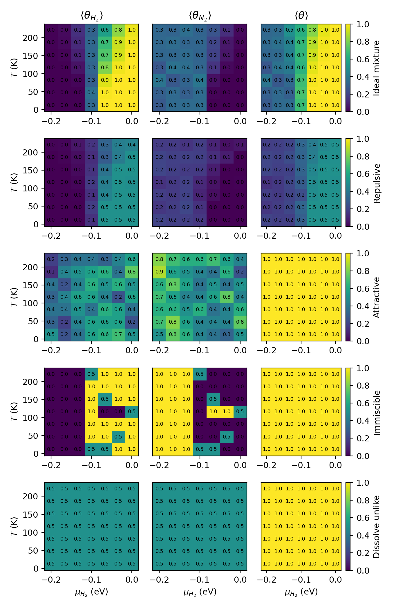

- Example lattice configurations:

We see the same trends in the resulting phase diagrams!

## 2: Complex geometries and interactions
A 4% Ru-Ba-K/C catalyst is an emerging catalyst for the Haber-Bosch process. Here we consider the adsorption of $H_2$ and $N_2$ on ruthenium 001 surfaces.
Ru (001) surface is hexagonal. 
[Jacobi](https://doi.org/10.1002/(SICI)1521-396X(200001)177:1%3C37::AID-PSSA37%3E3.0.CO;2-Y) found the binding energy of nitrogen gas to be -0.5 eV, with the nitrogen binding on the top site of Ru atom.
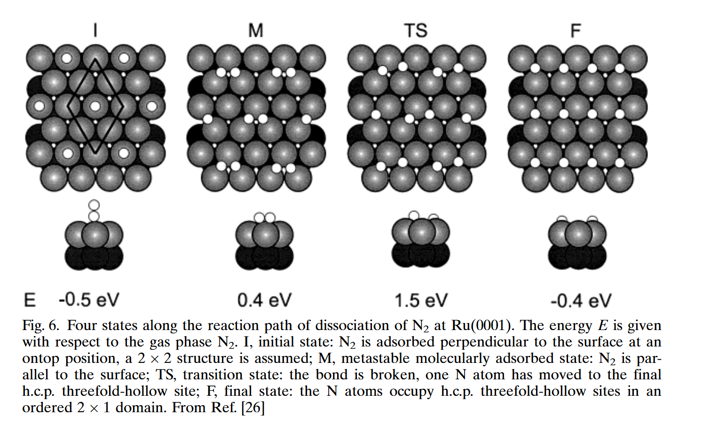
[Ungerer and Leeuw](https://pubs.rsc.org/en/content/articlelanding/2025/cp/d4cp04165h) found the total adsorption energy of molecular $H_2$, including its dissociation into elemental H*, to be around -1.34 eV.
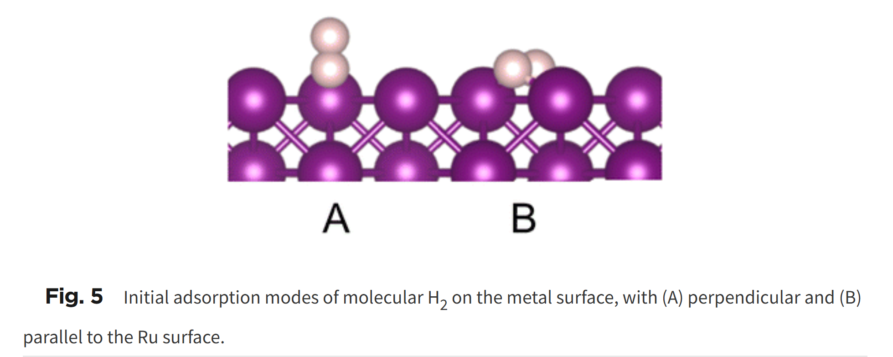
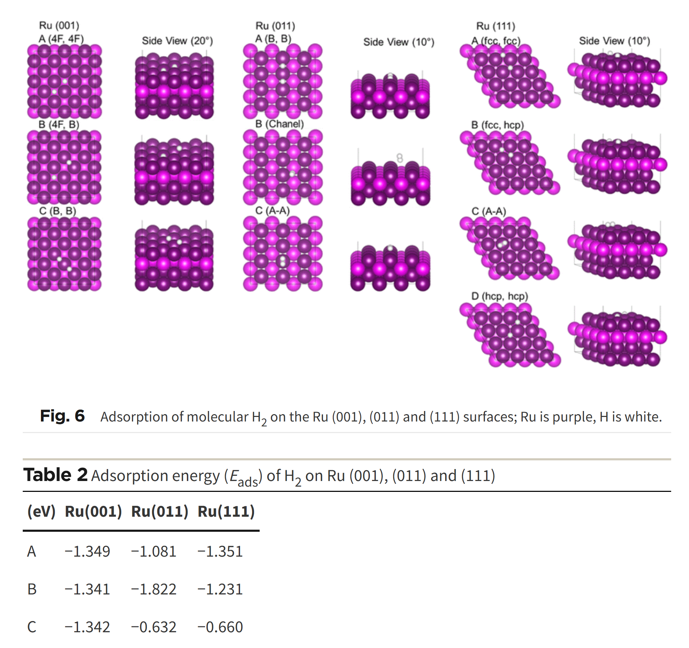
**For simplicity's sake, we assume both $H_2$ and $N_2$ bind to the top sites, with $\epsilon_{H_2}=-1.34eV$ and $\epsilon_{N_2}=-0.5eV$.**
We model the interaction between $H_2$ and $N_2$ using Lennard-Jones potential.
$$ V(r) = 4\epsilon\left[ (\frac{\sigma}{r})^{12} - (\frac{\sigma}{r})^{6} \right] $$
With data from [Wang et al](https://pubs-acs-org.libproxy.washu.edu/doi/pdf/10.1021/acs.jctc.0c01132):
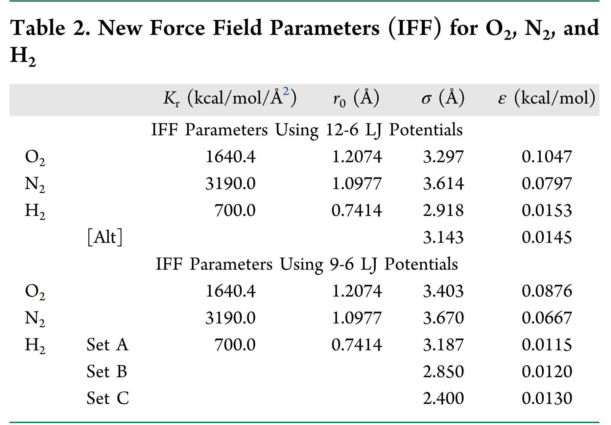
Lorentz-Berthelot mixing rules: $\sigma_{12} = \frac{\sigma_1+\sigma_2}{2}$ and $\epsilon_{12} = \sqrt{\epsilon_{1}\epsilon_{2}} $. 
We will use the following measures calculated using the first set of parameters (12-6 LJ):
| interaction | $\epsilon (eV)$ | $\sigma (Å)$ |
| ----------- | ------------------- | ------------ |
| $H_2$-$H_2$ | $6.6\times 10^{-4}$ |  2.918       |
| $N_2$-$N_2$ | $3.5\times 10^{-3}$ |  3.614       |
| $H_2$-$N_2$ | $1.5\times 10^{-3}$ |  3.266       |

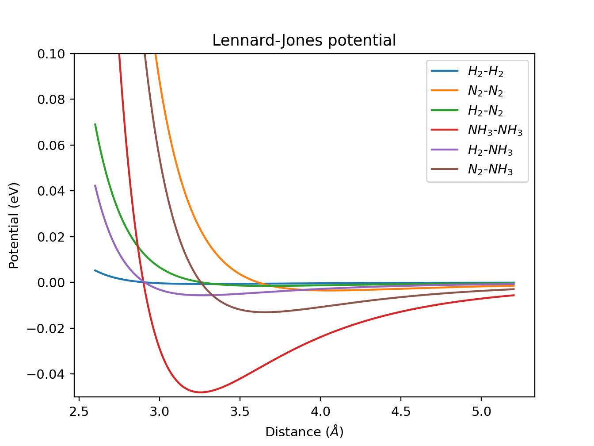

Ru bond length is calculated to be $2.645$ Å from the [mp-33 structure](https://next-gen.materialsproject.org/materials/mp-33?formula=Ru#crystal_structure). 
We will use a 4x4 lattice to model the adsorption process. As can be seen from the LJ curves above, the interactions are basically 0 when the particles are $2\times 2.645 = 5.29\AA$ away. This means using the minimum image convention is appropriate. 

We define the unit cell as a bounding parallelogram with $\alpha=60^{\cdot}$
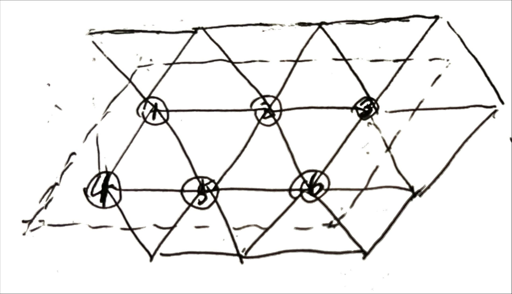
 
Simulation result:
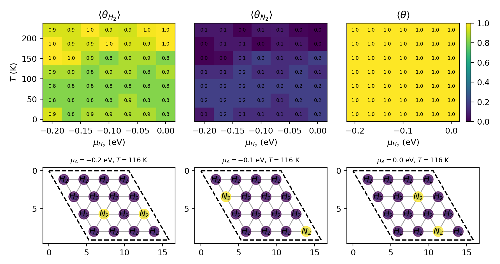

From the LJ curves, we observe that the attractions are much weaker than repulsions. $H_2$ weakly repells with itself, while all the other pairs repell strongly when 1-bond ($2.645 \AA$) apart. Combined with the large adsorption energy of $-1.34 eV$ for $H_2$, it makes sense that $H_2$ always dominates on the surface, which is not affected by change in $\mu_{H_2}$. The attractive network of $H_2$ is strong, and the incorporation of $N_2$ could be unfavorable due to repulsion. Increasing temperature favors the adsorption of $H_2$, which could be understood as thermal energy exceeds the adsorption energy of $N_2$ but not that of $H_2$, which leads to favorable adsorption of $H_2$. 
$T<150K$ seems to be the optimal condition in this model, which results in $\mu_{H_2}$ around 0.8 and $\mu_{N_2}$ around 0.2. 

## 3: Effect of lattice size

Since we are using minimum image convention, I expect the lattice size to have no influence on adsorption behavior when it is more than 2 times the interaction cutoff. For the square lattice with neighbor-neighbor interactions (cutoff=1), this means the lattice should at least be 3x3. 
Lattice size would have no impact on the ideal mixture at all, since no interaction is modeled. To observe effect of lattice size, we use the repulsive interaction scheme as an example. We run simulations on square lattices with repulsive interactions with different n. 

Here is a comparison between the phase diagrams using different lattice sizes:
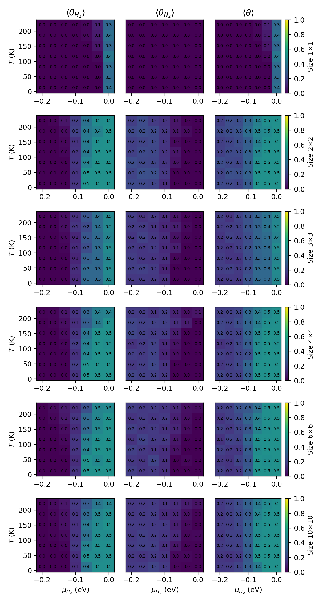
As expected, when n<2, the resulting phase diagram deviates from the others. When n>2, the resulting phase diagrams are consistent with each other. When n=2, the results also look good, but it is an edge case that should not be trusted.

## 4: Competition between 3 species
We include $NH_3$ in our model. 
[Danielson et al](https://www.sciencedirect.com/science/article/abs/pii/0039602878904508#:~:text=Abstract,100%20K%20will%20be%20discussed.) found that the desorption energy of $NH_3$ molecules from Ru(001) at low temperature (100K) can be 0.32 or 0.46 eV depending on its molecular states. For simplicity, we take the average and let its adsorption energy be $\epsilon_{NH_3}=-0.39eV$. 
For Lennard-Jones, we use $\sigma_{NH_3}=2.900$ and $\epsilon=4.8\times 10^{-2}eV$, using data from [Penn State University](https://personal.ems.psu.edu/~radovic/LennardJones_1.pdf).
| interaction | $\epsilon (eV)$ | $\sigma (Å)$ |
| ----------- | ------------------- | ------------ |
| $H_2$-$H_2$ | $6.6\times 10^{-4}$ |  2.918       |
| $N_2$-$N_2$ | $3.5\times 10^{-3}$ |  3.614       |
| $H_2$-$N_2$ | $1.5\times 10^{-3}$ |  3.266       |
|$NH_3$-$NH_3$| $4.8\times 10^{-2}$ |  2.900       |
|$H_2$-$NH_3$ | $5.6\times 10^{-3}$ |  2.909       |
|$N_2$-$NH_3$ | $1.3\times 10^{-2}$ |  3.257       |

Set $\mu_{NH_3}$ to -0.1 eV. 

Resulting phase diagram:
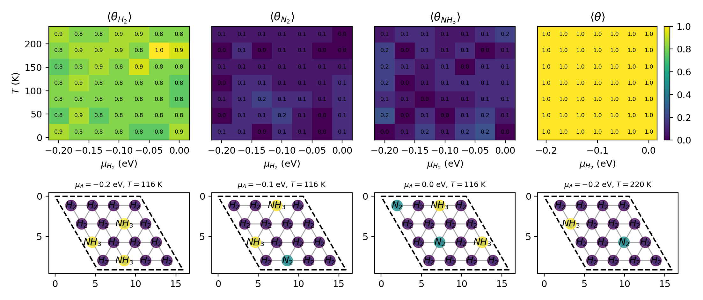
The same interpretations can be made for this model as the 2-species competitive model using LJ potential (optional #2). Although $NH_3$ has a large $\epsilon$ and therefore a stronger maximal attraction, our lattice is a discrete system with the two nearest distances being 1-bond (2.645$\AA$) and $\sqrt(3)$-bond (4.581$\AA$) long, where the repulsion of $NH_3$-$NH_3$ is very strong (2.645$\AA$) but the attraction quite weak (4.581$\AA$). Since the adsorption energy of $NH_3$ is also quite small, it is expected to behave similar to $N_2$. $H_2$ is still expected to dominate due to its weak repulsion and large adsorption energy. 
All the conditions produce similar coverage in this model. To further optimize ammonia synthesis, the following could be considered:

1. Raising the pressure (and therefore chemical potential) of $N_2$, which has a smaller adsorption energy compared to $H_2$ and stronger repulsion. This would help more $N_2$ bind to the surface.
2. Removing ammonia, therefore lowering its chemical potential. This would further lower the coverage of $NH_3$ on the surface, preventing it from blocking reaction sites.

## 5: Animation
Animation with $\mu_{H2}=0$ and $T=116K$, saving every 100 frames for a total simulation time of 10000 frames:
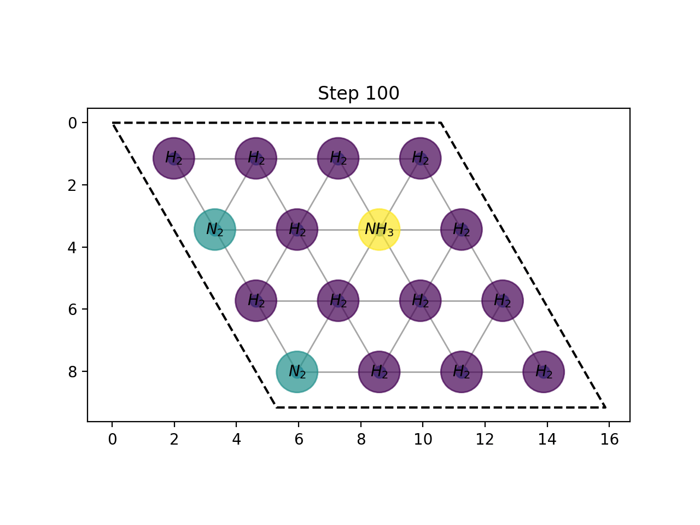

 

[back](../README.md)