<h1 style="text-align: center;"> Project 1 Report </h1>

This readme is for display purposes only. Please refer to the [pdf report document](./Chem_4050_Project_1_Report.pdf) for the actual report.

- [source notebook](./project_1.ipynb)
- [report pdf](./Chem_4050_Project_1_Report.pdf)

[back](../README.md)

---------------------------------

# Example system
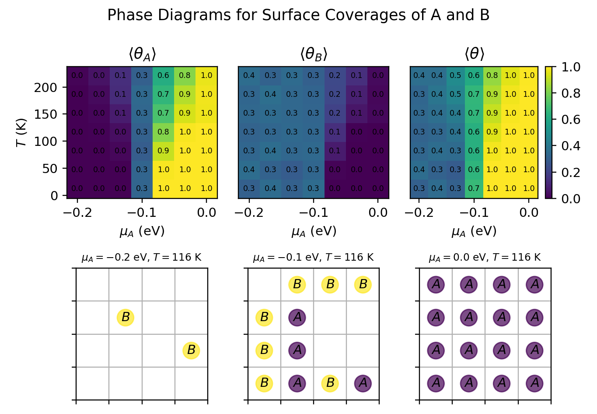

# Exploring adsorption of $N_2$ and $H_2$
- Phase diagrams:
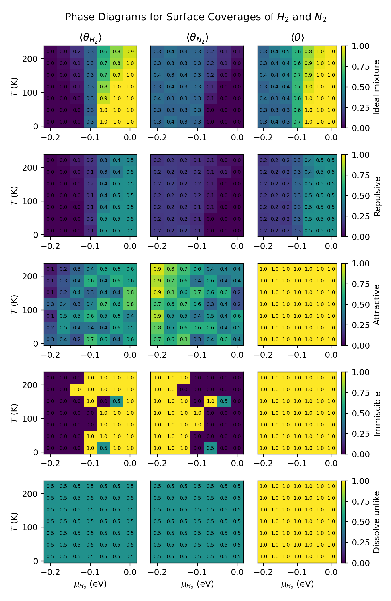
- Example lattice configurations:

# Optional Enhancement

## 1: particle swaps
- Phase diagrams using the same conditions for $H_2$ and $N_2$:

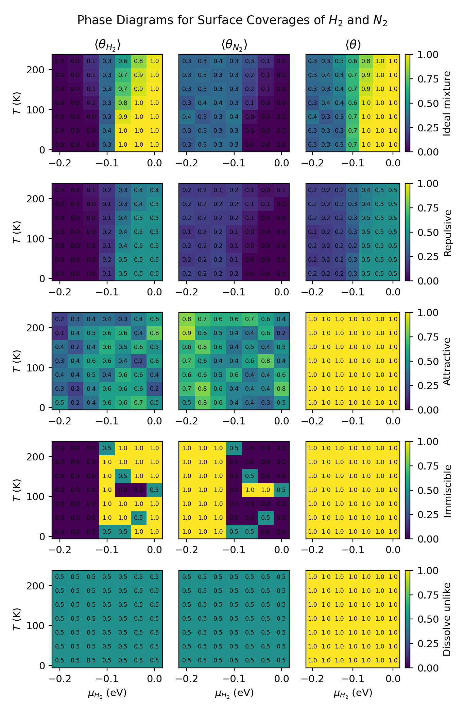

- Example lattice configurations:

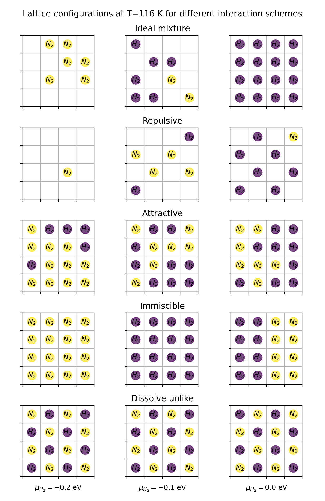

We see the same trends in the resulting phase diagrams!

## 2: Complex geometries and interactions
A 4% Ru-Ba-K/C catalyst is an emerging catalyst for the Haber-Bosch process. Here we consider the adsorption of $H_2$ and $N_2$ on ruthenium 001 surfaces.
Ru (001) surface is hexagonal. 
[Jacobi](https://doi.org/10.1002/(SICI)1521-396X(200001)177:1%3C37::AID-PSSA37%3E3.0.CO;2-Y) found the binding energy of nitrogen gas to be -0.5 eV, with the nitrogen binding on the top site of Ru atom.

[Ungerer and Leeuw](https://pubs.rsc.org/en/content/articlelanding/2025/cp/d4cp04165h) found the total adsorption energy of molecular $H_2$, including its dissociation into elemental H*, to be around -1.34 eV.
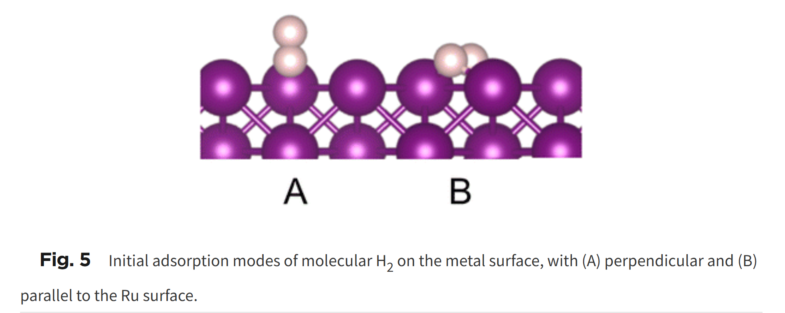
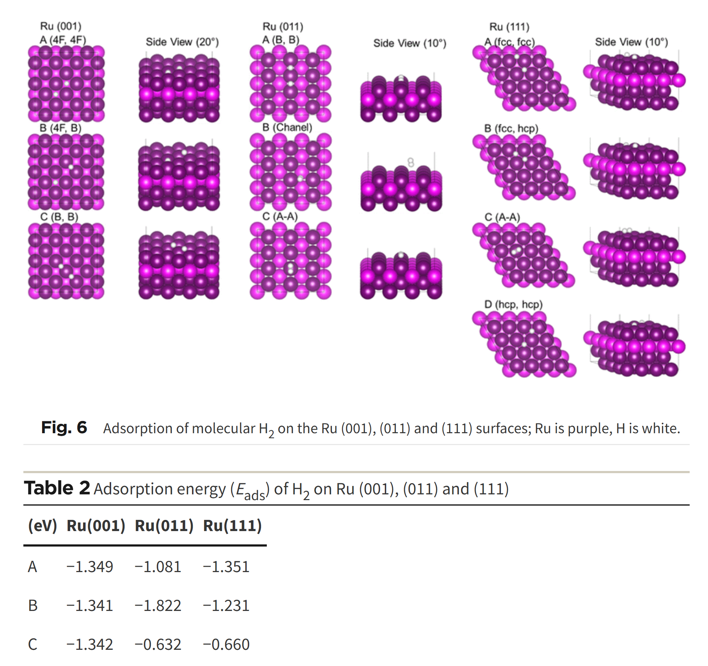
**For simplicity's sake, we assume both $H_2$ and $N_2$ bind to the top sites, with $\epsilon_{H_2}=-1.34eV$ and $\epsilon_{N_2}=-0.5eV$.**
We model the interaction between $H_2$ and $N_2$ using Lennard-Jones potential.
$$ V(r) = 4\epsilon\left[ (\frac{\sigma}{r})^{12} - (\frac{\sigma}{r})^{6} \right] $$
With data from [Wang et al](https://pubs-acs-org.libproxy.washu.edu/doi/pdf/10.1021/acs.jctc.0c01132):
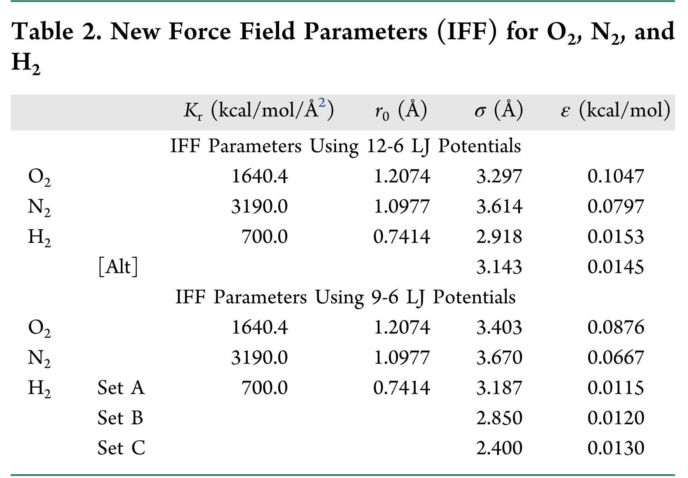
Lorentz-Berthelot mixing rules: $\sigma_{12} = \frac{\sigma_1+\sigma_2}{2}$ and $\epsilon_{12} = \sqrt{\epsilon_{1}\epsilon_{2}} $. 
We will use the following measures calculated using the first set of parameters (12-6 LJ):
| interaction | $\epsilon (eV)$ | $\sigma (Å)$ |
| ----------- | ------------------- | ------------ |
| $H_2$-$H_2$ | $6.6\times 10^{-4}$ |  2.918       |
| $N_2$-$N_2$ | $3.5\times 10^{-3}$ |  3.614       |
| $H_2$-$N_2$ | $1.5\times 10^{-3}$ |  3.266       |

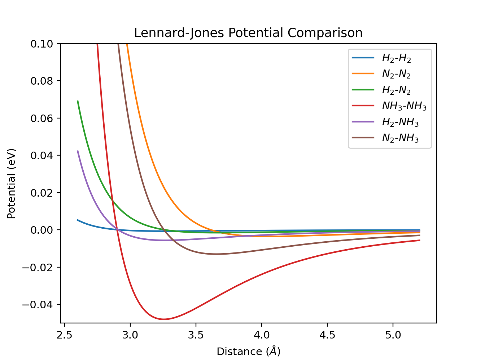

Ru bond length is calculated to be $2.645$ Å from the [mp-33 structure](https://next-gen.materialsproject.org/materials/mp-33?formula=Ru#crystal_structure). 
We will use a 4x4 lattice to model the adsorption process. As can be seen from the LJ curves above, the interactions are basically 0 when the particles are $2\times 2.645 = 5.29\AA$ away. This means using the minimum image convention is appropriate. 

We define the unit cell as a bounding parallelogram with $\alpha=60^{\cdot}$
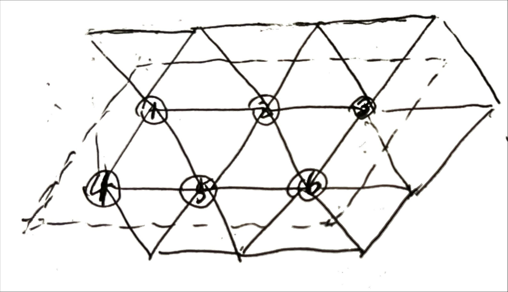
 
Simulation result:
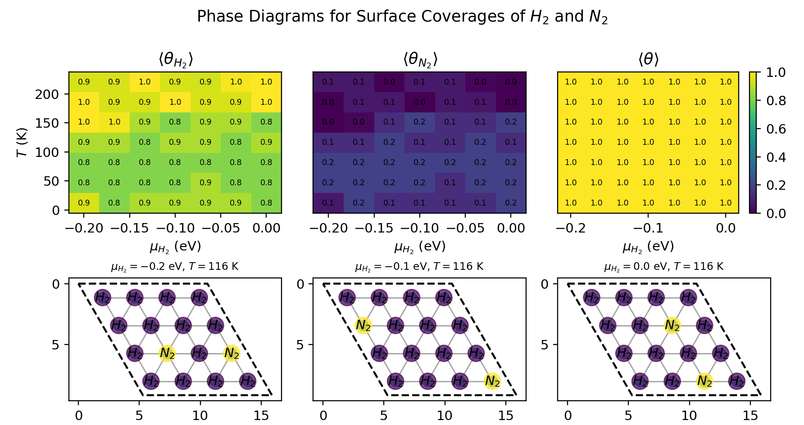

## 3: Effect of lattice size

Since we are using minimum image convention, I expect the lattice size to have no influence on adsorption behavior when it is more than 2 times the interaction cutoff. For the square lattice with neighbor-neighbor interactions (cutoff=1), this means the lattice should at least be 3x3.
Here is a comparison between the phase diagrams using different lattice sizes:

As expected, when n<2, the resulting phase diagram deviates from the others. When n>2, the resulting phase diagrams are consistent with each other.

## 4: Competition between 3 species
We include $NH_3$ in our model. 
[Danielson et al](https://www.sciencedirect.com/science/article/abs/pii/0039602878904508#:~:text=Abstract,100%20K%20will%20be%20discussed.) found that the desorption energy of $NH_3$ molecules from Ru(001) at low temperature (100K) can be 0.32 or 0.46 eV depending on its molecular states. For simplicity, we take the average and let its adsorption energy be $\epsilon_{NH_3}=-0.39eV$. 
For Lennard-Jones, we use $\sigma_{NH_3}=2.900$ and $\epsilon=4.8\times 10^{-2}eV$, using data from [Poling et al](https://personal.ems.psu.edu/~radovic/LennardJones_1.pdf).
| interaction | $\epsilon (eV)$ | $\sigma (Å)$ |
| ----------- | ------------------- | ------------ |
| $H_2$-$H_2$ | $6.6\times 10^{-4}$ |  2.918       |
| $N_2$-$N_2$ | $3.5\times 10^{-3}$ |  3.614       |
| $H_2$-$N_2$ | $1.5\times 10^{-3}$ |  3.266       |
|$NH_3$-$NH_3$| $4.8\times 10^{-2}$ |  2.900       |
|$H_2$-$NH_3$ | $5.6\times 10^{-3}$ |  2.909       |
|$N_2$-$NH_3$ | $1.3\times 10^{-2}$ |  3.257       |

Set $\mu_{NH_3}$ to -0.1 eV. 

Resulting phase diagram:

## 5: Animation
Animation with $\mu_{H2}=0$ and $T=116K$, saving every 100 frames for a total simulation time of 10000 frames:
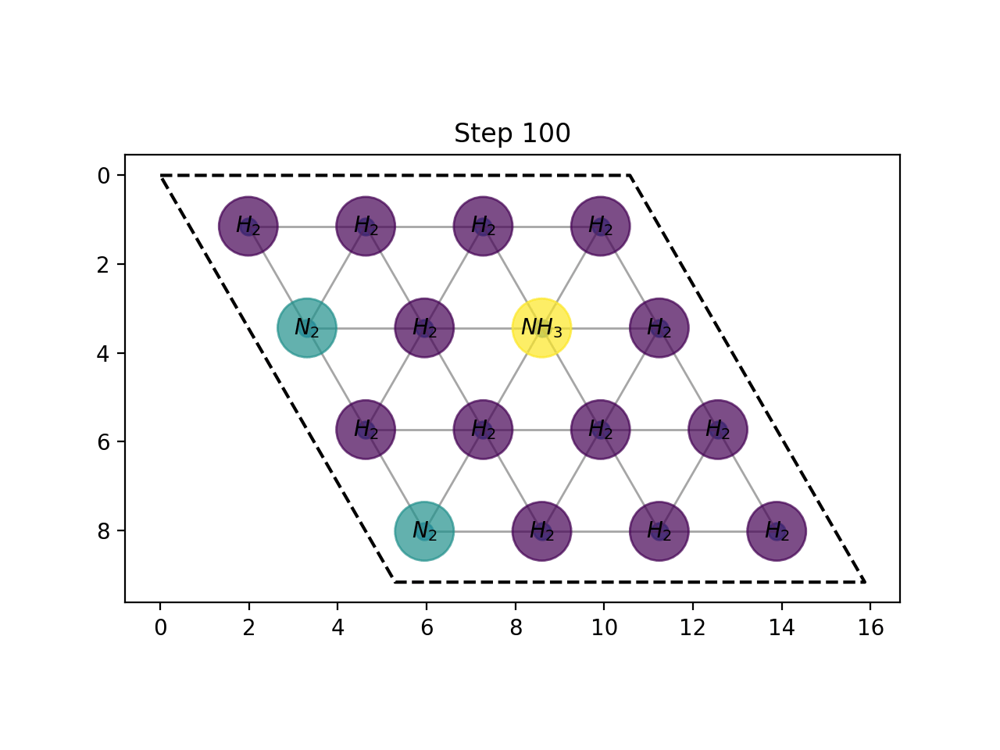

 

[back](../README.md)
