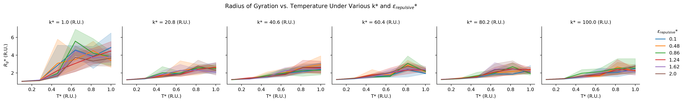
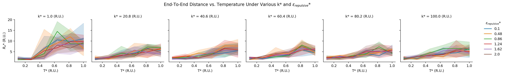
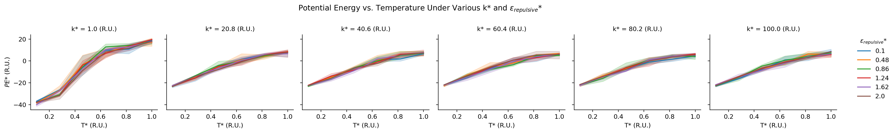
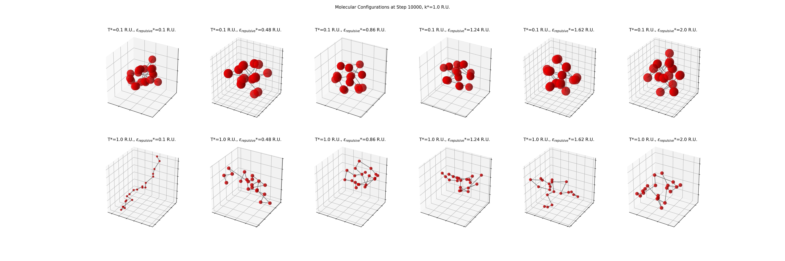
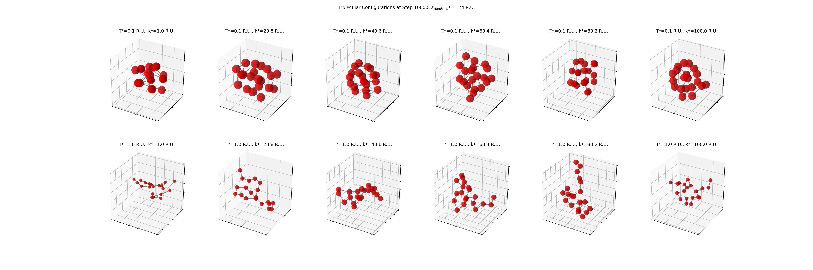
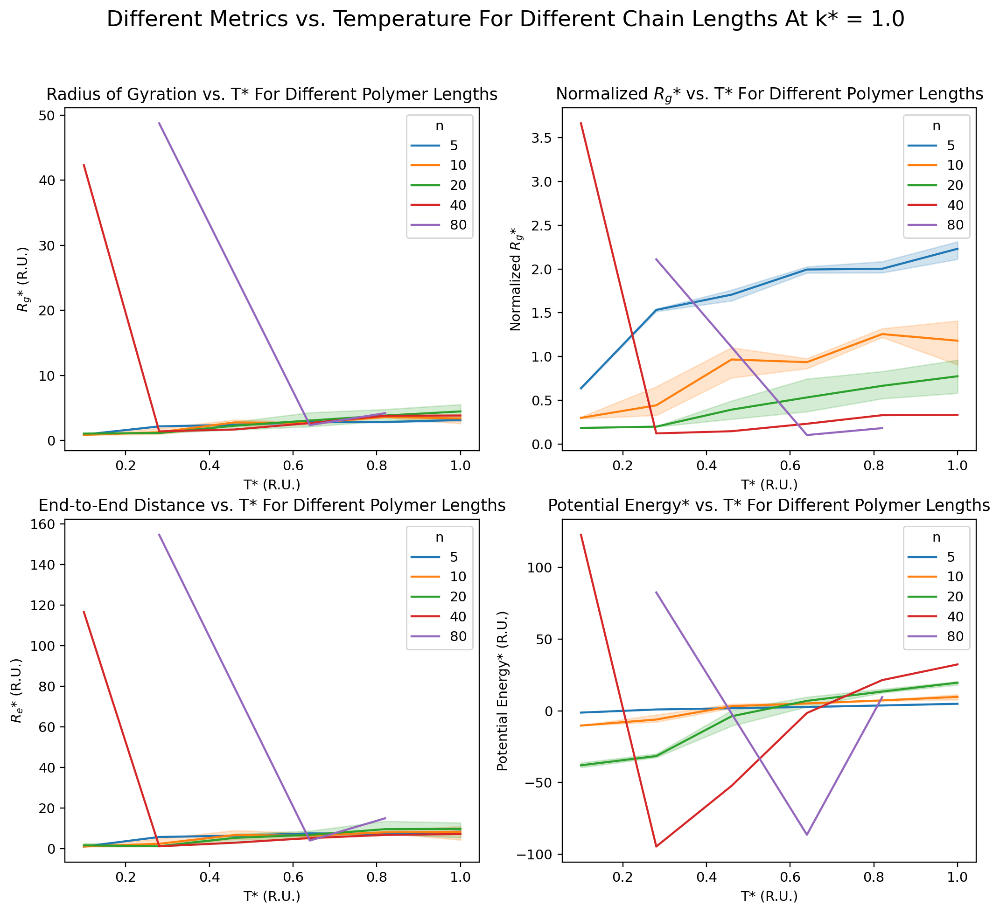
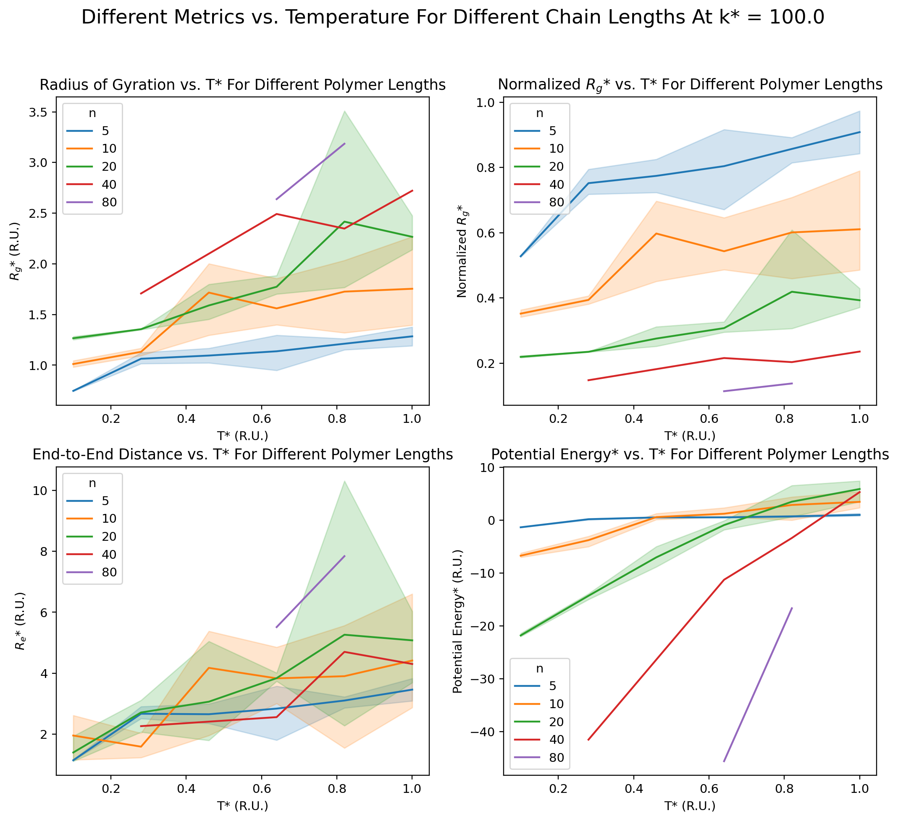
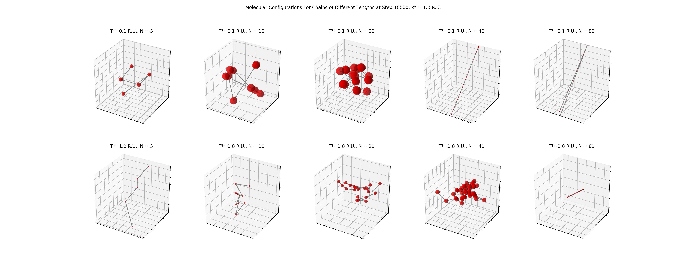
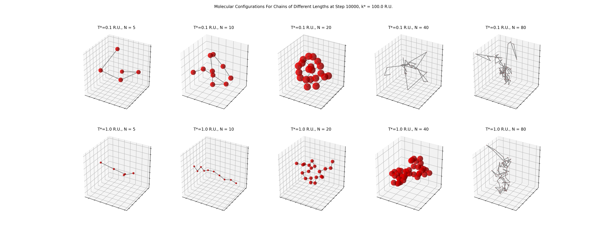

<h1 style="text-align: center;"> Project 2 Report </h1>

This readme is for display purposes only. Please refer to the [pdf report document](./Chem_4050_Project_2_Report.pdf) for the actual report.

- [source notebook](./project_2.ipynb)
- [report pdf](./Chem_4050_Project_2_Report.pdf)

[back](../README.md)

---------------------------------
# Coarse-Grain Molecular Dynamics On a Linear Homopolymer

Radius of gyration plotted against temperature. Columns are grouped by spring constants. Lines colored by $\epsilon_{repulsive}$. Error bands show 95\% confidence intervals for 3 duplicates. R.U. denote reduced unit.

End-to-end distance plotted against temperature. Columns are grouped by spring constants. Lines colored by $\epsilon_{repulsive}$. Error bands show 95\% confidence intervals for 3 duplicates. R.U. denote reduced unit.

Potential energy of the system plotted against temperature. Columns are grouped by spring constants. Lines colored by $\epsilon_{repulsive}$. Error bands show 95\% confidence intervals for 3 duplicates. R.U. denote reduced unit.

Visualizations of the polymer configuration at the last trajectory frame with $k=1.0$ and varying $\epsilon_{repulsive}$. Rows grouped by temperature; columns grouped by $\epsilon_{repulsive}$. Plots are enlarged around the polymer; the size of the particles is constant with regard to unit cell length. R.U. denote reduced unit.

Visualizations of the polymer configuration at the last trajectory frame with $\epsilon_{repulsive}=1.24$ and varying $k$. Rows grouped by temperature; columns grouped by $k$. Plots are enlarged around the polymer; the size of the particles is constant with regard to unit cell length. R.U. denote reduced unit.

Different metrics plotted against temperature for different chain lengths at $k=1.0$ and $\epsilon_{repulsive}=1.24$. Error bands show 95\% confidence intervals. Note that systems of $N=5, 10, 20$ are aggregated across three duplicates, while systems of $N=40, 80$ have only one duplicate. Invalid results not plotted.

Different metrics plotted against temperature for different chain lengths at $k=100.0$ and $\epsilon_{repulsive}=1.24$. Error bands show 95\% confidence intervals. Note that systems of $N=5, 10, 20$ are aggregated across three duplicates, while systems of $N=40, 80$ have only one duplicate. Invalid results not plotted.

Visualizations of the polymer configuration at the last trajectory frame with $k^*=1.0$ and varying chain length $N$. Rows grouped by temperature; columns grouped by $N$. The unit cell dimensions are $25$, $50$, $100$, $200$ and $400$, respectively from left column to right. Plots are enlarged around the polymer; the size of the particles is constant with regard to unit cell length. R.U. denote reduced unit.

Visualizations of the polymer configuration at the last trajectory frame with $k^*=100.0$ and varying chain length $N$. Rows grouped by temperature; columns grouped by $N$. The unit cell dimensions are $25$, $50$, $100$, $200$ and $400$, respectively from left column to right. Plots are enlarged around the polymer; the size of the particles is constant with regard to unit cell length. R.U. denote reduced unit.